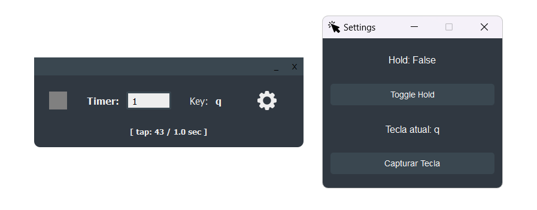

# Auto-Click

O **Auto-Click** é uma ferramenta prática e intuitiva para automação de cliques no mouse. Com este aplicativo, você pode personalizar a velocidade dos cliques, definir a tecla de ativação e escolher entre os modos de ativação por clique único ou tecla pressionada.

## Principais Funcionalidades

- **Velocidade Personalizável**: Configure o intervalo de cliques em segundos, ajustando a velocidade conforme sua necessidade.
- **Tecla de Ativação**: Defina uma tecla específica para ativar ou desativar o Auto-Click.
- **Modos de Ativação**:
  - Pressionar e segurar a tecla para ativação contínua.
  - Clique único para ativação ou desativação do Auto-Click.

## Capturas de Tela



## Como Usar

1. Abra o aplicativo **Auto-Click**.
2. Configure a velocidade desejada no campo de temporizador.
3. Escolha o botão do mouse e a tecla de ativação.
4. Selecione o modo de ativação desejado:
   - **Pressione e segure**: O Auto-Click estará ativo enquanto a tecla for pressionada.
   - **Clique único**: O Auto-Click será ativado/desativado ao pressionar a tecla.
5. Minimize o aplicativo ou deixe-o em segundo plano. O Auto-Click continuará funcionando.

## Requisitos do Sistema

- **Sistema Operacional**: Windows 7 ou superior.
- **Dependências**: Python 3.9 ou superior, PyQt5 e PyAutoGUI.

## Instalação

1. Baixe a versão mais recente do aplicativo na aba [Releases](https://github.com/seu-usuario/auto-click/releases).
2. Execute o instalador e siga as instruções na tela.
3. Após a instalação, o aplicativo estará disponível no menu Iniciar.

### Rodando a partir do código-fonte

1. Clone este repositório:
   ```bash
   git clone https://github.com/seu-usuario/auto-click.git
